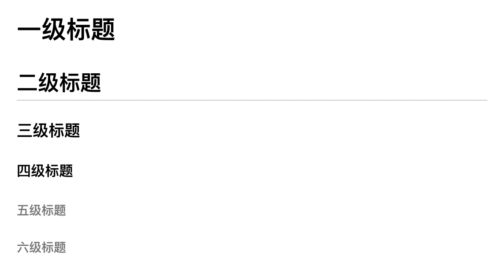
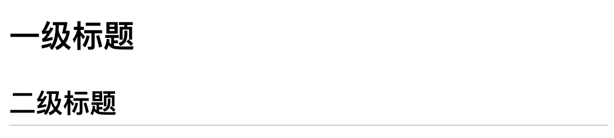

# 分级标题
我们应该都用过word，在word中可以对字体设置为标题格式，标题格式的字体会加粗且字号较大，而标题又分为很多个级别，一级、二级、三级……字号也依次变小；

Markdown的标题格式有两种语法，一种只支持二级，另一种可以支持六级，大家根据自己的习惯选择使用。不过作者还是建议使用六级的形式，因为我们写文章，含有超过2级的情况是很常见的。

## 六级标题法
使用“#”号来设置标题，一个“#”表示一级。注意，标题要独立写一个行内。

    # 一级标题
    ## 二级标题
    ### 三级标题
    #### 四级标题
    ##### 五级标题
    ###### 六级标题

效果图如下：  

这里的二级标题下自动生成了一个下划线，注意，这个是MacDown这个软件生成的，其它软件并没有这个修饰。另外，“#”号后的空格不是必须的，不过加一个空格后看起来会更加清晰。

五级标题和六级标题的区别已经不大了。

## 二级标题法
在一行文字下使用3个以上“=”号，并且“=”后没有其它字符，则表示一级标题。在一行文字下使用3个以上“-”中划线，并且“-”后没有其它字符，则表示二级标题。

    一级标题
    ===
    二级标题
    ---

效果图如下：

使用这种标题法的人，一般都是为了醒目，所以会使用很多个“=”或“-”在源文档中起到显眼的分隔效果。

    这是一个醒目的一级标题
    ================================
    这是一个醒目的二级标题
    --------------------------------