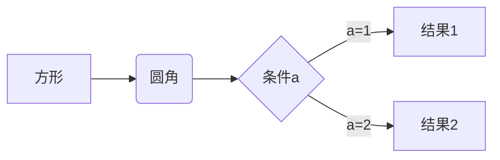
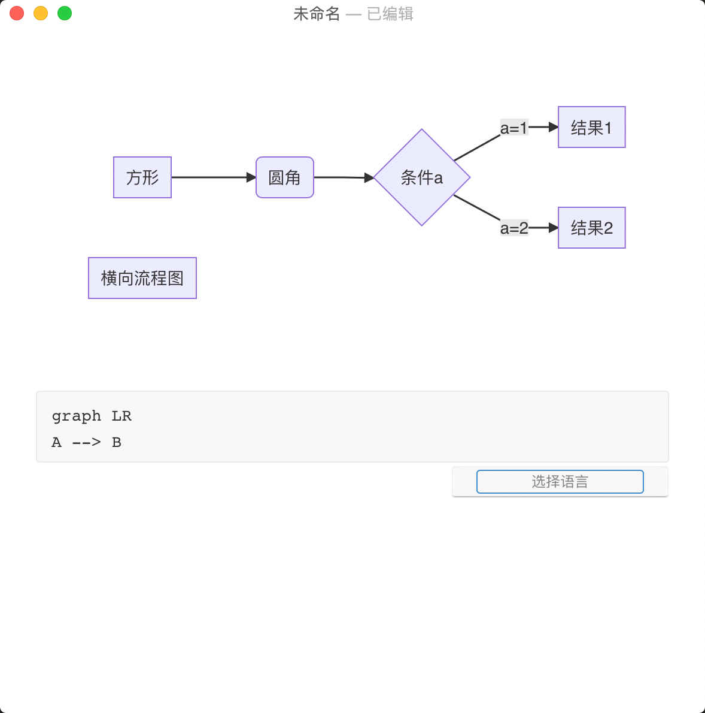
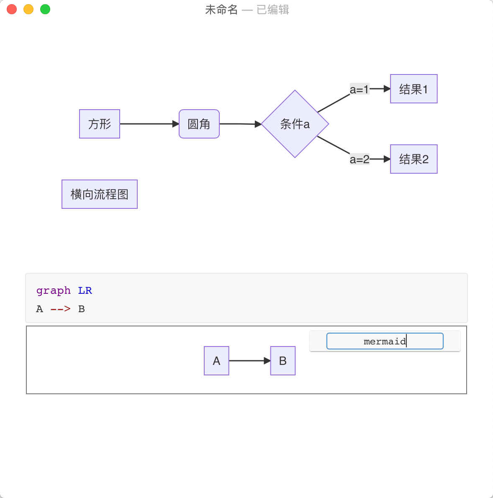
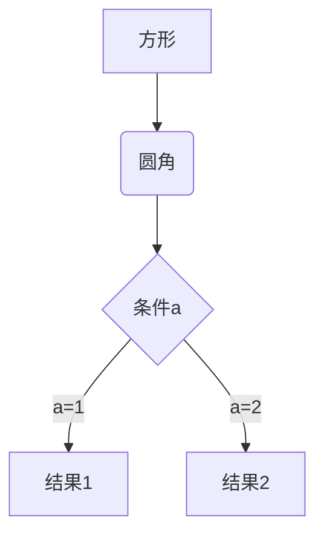

# 流程图

文章中如果有强逻辑的内容，使用流程图可以让表述更加清楚，读者也更容易了解。Markdown对流程图支持的也很好，不过它并不是Markdown自身语法，靠的是第三方能力的支持。Markdown中我们一般使用mermaid来绘制流程图。

先来看一下实例：

```
    ```mermaid
    graph LR
    A[方形] -->B(圆角)
    B --> C{条件a}
    C -->|a=1| D[结果1]
    C -->|a=2| E[结果2]
    ```
```

展示为：



## Markdown流程图编辑工具

上面我们说了，流程图默认不属于Markdown语法，所以很多工具默认是不支持流程图语法的，Mac上的Macdown就不支持，不过Mac上有另外一个知名的软件Typora支持。我们看一下Typora的展示界面：



在Typora中写一段代码区后，在它右下角有一个“选择语言”的输入框，点击并输入“mermaid”后，代码区的代码会被解释为流程图并展示，如：



## 流程图语法简介

mermaid绘制流程的功能和语法非常丰富，我们先通过将上面那个实例做一下介绍，知道写流程图的大致步骤。关于Mermaid画流程图的详细语法会在下一部分展示，可以根据自己的需求学习和使用。

（1）流程图本质上是一段代码区的内容被指定了mermaid语言，从而被解释执行并绘制，所以代码整体格式为指定语言的代码区，不熟悉的同学可以“[代码块](../common_syntax/program_code.md)”一节学习。所以代码的主架构为：

```
    ```mermaid
    流程图代码……
    ```
```

（2）在流程图代码第一行要使用“graph”开从，表示下面的代码是mermaid中的流程图编码；在“graph”的后面加一个空格后的部分表示流程图的方向，这里的LR表示从左到右，还有另外几种方向表示方法：

| 标识码 | 意义 |
| --- | --- |
| TB | 从上到下（top to bottom）|
| TD | 也是从上到下（top to down |
| BT | 从下到上（bottom to top）|
| RL | 从右到左（right to left）|
| LR | 从左到右（left to right）|

把上边的代码改为从上到下：

```
    ```mermaid
    graph TB
    A[方形] -->B(圆角)
    B --> C{条件a}
    C -->|a=1| D[结果1]
    C -->|a=2| E[结果2]
    ```
```

显示为：



（3）流程图的每个节点有两部分组成，节点标识和节点内容。“节点内容”部分不是必须的，如果没有“节点内容”部分，则会将节点标识显示在节点上。为了便于表示节点之间的关系，建议将“节点标识”定为英文。

+ 节点标识，如：`A[方形]`中，“A”表示节点标识。
+ 节点内容，节点内容需要用括号括起来，不同的括号表示节点不同的形状，如上面实例中，中括号“[]”表示节点形状为矩形，小括号表示为圆角矩形。还有更多的形状可以从下边的文档中查询。

（4）节点间关系使用箭头链接，如“-->”，在上边的实例中，流程图A节点到B节点，它们之间使用“A[方形] -->B(圆角)”，当表示B到C的关系时使用“B --> C{条件a}”，注意，只有当一个节点第一次出现时才需要节点的完全定义形式（节点标识 + 节点内容），后面再表示节点关系时，只使用节点标识即可。

两个节点之间关系代码要放在独立行内，新的关系再独立起一行。

## Mermaid中流程图语法详细文档

下面这个文档是Mermaid的官方文档，目前只有英文版的，不过英文都比较简单。

[Mermaid graph](mermaid_graph_doc.md ':include')
