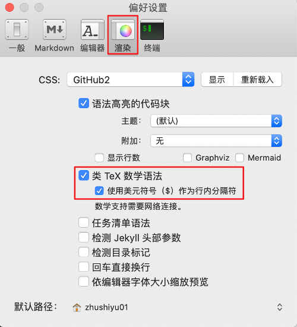
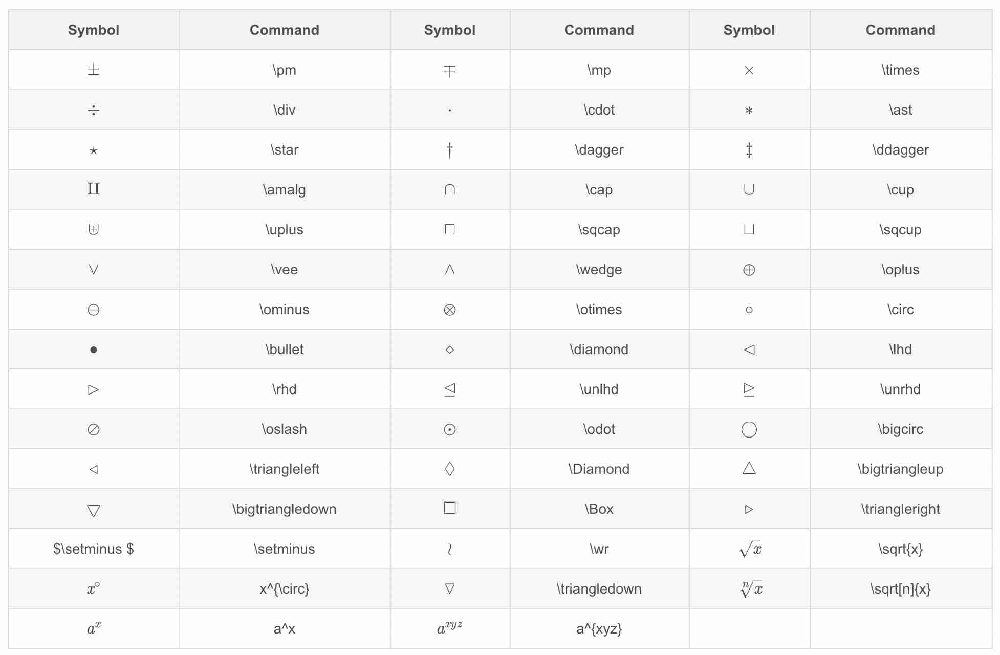
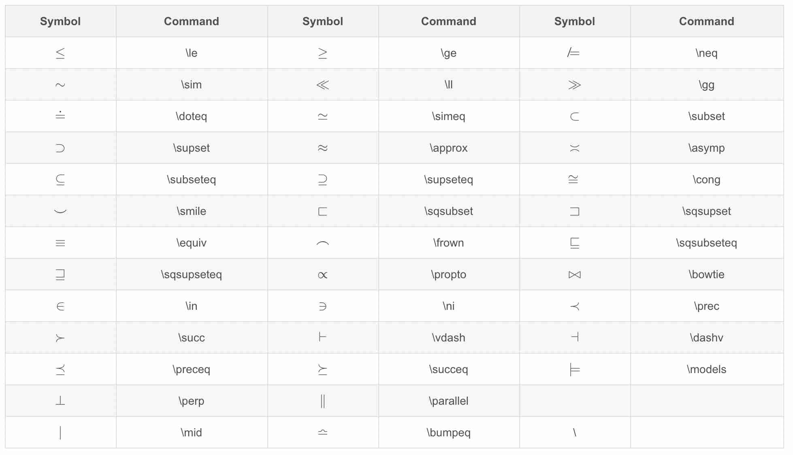
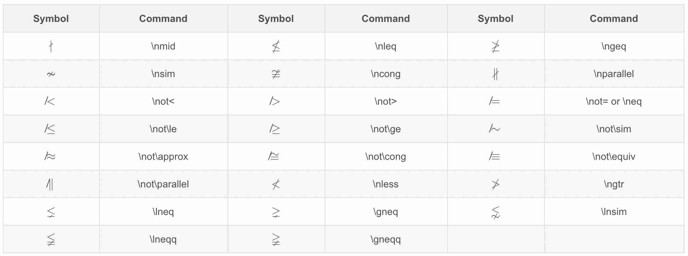
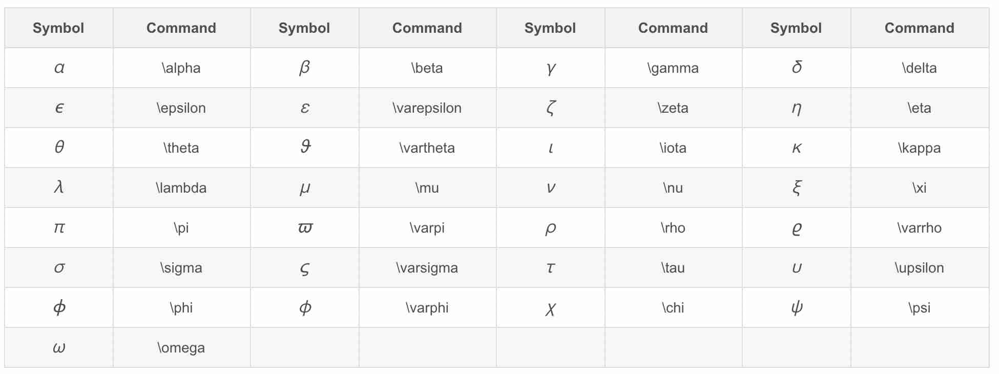
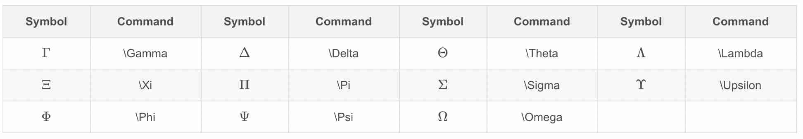
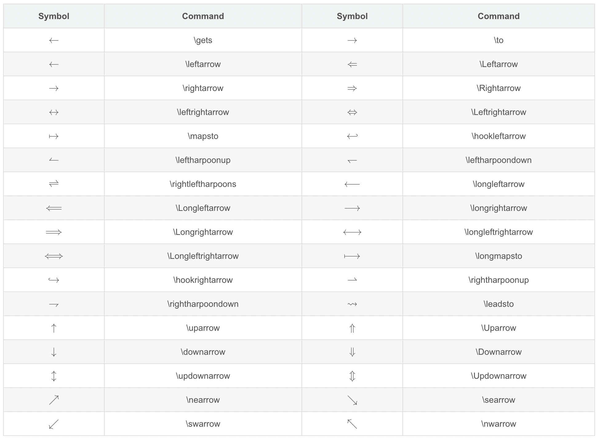
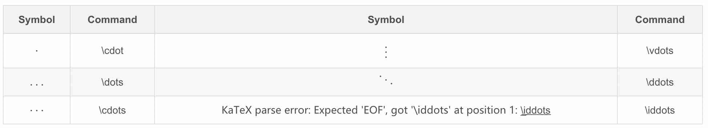

# 数学公式
如果你写的文章是数学或化学类的文章，或者写一些算法相关的文章，难免在文章中会遇到数学公式，MarkDown对数学公式的编写也有很好的支持。

我们先看两个例子：

$$ \lim_{x \to +\infty}\frac{1}{x}$$
$$\frac{x^{2}y^{2}}{x+y}$$

Markdown的数学公式是基于Latex的编码排版系统实现的，它可以让我们通过一定的规则的编码，实现复杂的数学或化学公式的效果。

注意，Macdown默认状态下latex是没有打开的，所以我们书写的编码不会转化为公式，打开方法为：MacDown->偏好设置，按下图设置。



# 公式显示在行内与独行
markdown的公式以两个`$`美元符号包裹。

+ 行内显示公式，直接使用两个“\$”即可，如：`$\Gamma(n) = (n-1)!$`，显示为：$\Gamma(n) = (n-1)!$
+ 在独立行公式，则公式两边各需要两个“\$”，公式公插入到新的一行内，并且居中，如：`$$x_n\stackrel{p}\longrightarrow\mu$$`，显示为：$$x_n\stackrel{p}\longrightarrow\mu$$

接下来我们来学习公式都是如何表示的。

# 上标、下标与组合
+ 上标符号，符号：\^，如：`$x^4$`，显示为：$x^4$
+ 下标符号，符号：\_，如：`$x_1$`，显示为：$x_1$
+ 组合符号，上面两个例子我们发现，标示符号只对它前后的一个字符生效，如果要想有多个字符生效怎么办呢？可以使用组合符号，组合符号为：\{\}，如：`${16}_{8}O{2+}_{2}$`，显示为：${16}_{8}O{2+}_{2}$

# 汉字、字体与格式
+ 汉字形式，符号：\mbox{}，使用后可以让汉字显示的更大一些，如：`$V_{\mbox{初始}}$`，显示为：$V_{\mbox{初始}}$，如果不加mbox：`$V_{初始}$`，则显示为：$V_{初始}$
+ 字体控制，符号：\displaystyle，可以让公式显示的更大一些，如：`$\displaystyle \frac{x+y}{y+z}$`，显示为：$\displaystyle \frac{x+y}{y+z}$，如果不加displaystyle：`$\frac{x+y}{y+z}$`，则显示为：$\frac{x+y}{y+z}$；
+ 下划线符号，符号：\underline，如：`$\underline{x+y}$`，显示为：$\underline{x+y}$
+ 上大括号，符号：\overbrace{算式}，如：`$\overbrace{a+b+c+d}^{2.0}$`，显示为：$\overbrace{a+b+c+d}^{2.0}$
+ 下大括号，符号：\underbrace{算式}，如：`$a+\underbrace{b+c}_{1.0}+d$`，显示为：$a+\underbrace{b+c}_{1.0}+d$
+ 上位符号，符号：\stackrel{上位符号}{基位符号}，如：`$\vec{x}\stackrel{\mathrm{def}}{=}{x_1,\dots,x_n}$`，显示为：$\vec{x}\stackrel{\mathrm{def}}{=}{x_1,\dots,x_n}$

# 占位符

+ 一个quad空格，符号：\quad，如：`$x \quad y$`，显示为：$x \quad y$
+ 两个quad空格，符号：\qquad，如：`$x \qquad y$`，显示为：$x \qquad y$

# 定界符与组合

+ 括号，符号：(……)、\big(……\big)、\Big(……\Big)、\bigg(……\bigg)、\Bigg(……\Bigg)，每个插件依次变大如：`$(1)-\big(2\big) -\Big(3\Big)-\bigg(4\bigg)-\Bigg(5\Bigg)$`，显示为：$(1)-\big(2\big) -\Big(3\Big)-\bigg(4\bigg)-\Bigg(5\Bigg)$
+ 中括号，符号：[]（直接写），如：`$[x+y]$`，显示为：$[x+y]$
+ 大括号，符号：\{ \}（需要转义），如：`$\{x+y\}$`，显示为：$\{x+y\}$
+ 自适应大小括号，符号：\left(……\right)，如：`$\left(\displaystyle \frac{x+y}{y+z}\right)$`，显示为：$\left(\displaystyle \frac{x+y}{y+z}\right)$
+ 组合公式，符号：{上位公式 \choose 下位公式}，如：`${n+1 \choose k}={n \choose k}+{n \choose k-1}$`，显示为：${n+1 \choose k}={n \choose k}+{n \choose k-1}$
+ 组合公式，符号：{上位公式 \atop 下位公式}，如：`$\sum_{k_0,k_1,\ldots>0 \atop k_0+k_1+\cdots=n}A_{k_0}A_{k_1}\cdots$`，显示为：$\sum_{k_0,k_1,\ldots>0 \atop k_0+k_1+\cdots=n}A_{k_0}A_{k_1}\cdots$

# 四则运算

+ 加法运算，符号：+，如：`$x+y=z$`，显示为：$x+y=z$
+ 减法运算，符号：-，如：`$x-y=z$`，显示为：$x-y=z$
+ 加减运算，符号：\pm，如：`$x \pm y=z$`，显示为：$x \pm y=z$
+ 减甲运算，符号：\mp，如：`$x \mp y=z$`，显示为：$x \mp y=z$
+ 乘法运算，符号：\times，如：`$x \times y=z$`，显示为：$x \times y=z$
+ 点乘运算，符号：\cdot，如：`$x \cdot y=z$`，显示为：$x \cdot y=z$
+ 星乘运算，符号：\ast，如：`$x \ast y=z$`，显示为：$x \ast y=z$
+ 除法运算，符号：\div，如：`$x \div y=z$`，显示为：$x \div y=z$
+ 斜法运算，符号：/，如：`$x/y=z$`，显示为：$x/y=z$
+ 分式表示，符号：\frac{分子}{分母}，如：`$\frac{x+y}{y+z}$`，显示为：$\frac{x+y}{y+z}$
+ 分式表示，符号：{分子} \voer {分母}，如：`${x+y} \over {y+z}$`，显示为：${x+y} \over {y+z}$
+ 绝对值表示，符号：||，如：`$|x+y|$`，显示为：$|x+y|$

# 高级运算

+ 平均数运算，符号：\overline{算式}，如：`$\overline{xyz}$`，显示为：$\overline{xyz}$
+ 开二次方运算，符号：\sqrt，如：`$\sqrt x$`，显示为：$\sqrt x$
+ 开方运算，符号：\sqrt[开方数]{被开方数}，如：`$\sqrt[3]{x+y}$`，显示为：$\sqrt[3]{x+y}$
+ 对数运算，符号：\log，如：`$\log(x)$`，显示为：$\sqrt[3]{x+y}$
+ 极限运算，符号：\lim，如：`$\lim^{x \to \infty}_{y \to 0}{\frac{x}{y}}$`，显示为：$\sqrt[3]{x+y}$
+ 极限运算，符号：\displaystyle \lim，如：`$\displaystyle \lim^{x \to \infty}_{y \to 0}{\frac{x}{y}}$`，显示为：$\displaystyle \lim^{x \to \infty}_{y \to 0}{\frac{x}{y}}$
+ 求和运算，符号：\sum，如：`$\sum^{x \to \infty}_{y \to 0}{\frac{x}{y}}$`，显示为：$\displaystyle \lim^{x \to \infty}_{y \to 0}{\frac{x}{y}}$
+ 求和运算，符号：\displaystyle \sum，如：`$\displaystyle \sum^{x \to \infty}_{y \to 0}{\frac{x}{y}}$`，显示为：$\displaystyle \sum^{x \to \infty}_{y \to 0}{\frac{x}{y}}$
+ 积分运算，符号：\int，如：`$\int^{\infty}_{0}{xdx}$`，显示为：$\int^{\infty}_{0}{xdx}$
+ 积分运算，符号：\displaystyle \int，如：`$\displaystyle \int^{\infty}_{0}{xdx}$`，显示为：$\displaystyle \int^{\infty}_{0}{xdx}$
+ 微分运算，符号：\partial，如：`$\frac{\partial x}{\partial y}$`，显示为：$\frac{\partial x}{\partial y}$
+ 矩阵表示，符号：`\begin{matrix} \end{matrix}`，如：

```
$$
A=\left[
    \begin{matrix}
        1&2&3&\\\\
        2&2&3&\\\\
        3&2&3&
    \end{matrix}
\right]
$$
```
显示为：
$$
A=\left[
    \begin{matrix}
        1&2&3&\\\\
        2&2&3&\\\\
        3&2&3&
    \end{matrix}
\right]
$$

# 逻辑运算
+ 属于运算，符号：\in，如：`$x \in y$`，显示为：$x \in y$
+ 不属于运算，符号：\notin，如：`$x \notin y$`，显示为：$x \notin y$
+ 不属于运算，符号：\not\in，如：`$x \not\in y$`，显示为：$x \not\in y$
+ 子集运算，符号：\subset，如：`$x \subset y$`，显示为：$x \subset y$
+ 子集运算，符号：\supset，如：`$x \supset y$`，显示为：$x \supset y$
+ 真子集运算，符号：\subseteq，如：`$x \subseteq y$`，显示为：$x \subseteq y$
+ 非真子集运算，符号：\subsetneq，如：`$x \subsetneq y$`，显示为：$x \subsetneq y$
+ 真子集运算，符号：\supseteq，如：`$x \supseteq y$`，显示为：$x \supseteq y$
+ 非真子集运算，符号：\supsetneq，如：`$x \supsetneq y$`，显示为：$x \supsetneq y$
+ 非子集运算，符号：\not\subset，如：`$x \not\subset y$`，显示为：$x \not\subset y$
+ 非子集运算，符号：\not\supset，如：`$x \not\supset y$`，显示为：$x \not\supset y$
+ 并集运算，符号：\cup，如：`$x \cup y$`，显示为：$x \cup y$
+ 交集运算，符号：\cap，如：`$x \cap y$`，显示为：$x \cap y$
+ 差集运算，符号：\setminus，如：`$x \setminus y$`，显示为：$x \setminus y$
+ 同或运算，符号：\bigodot，如：`$x \bigodot y$`，显示为：$x \bigodot y$
+ 同与运算，符号：\bigotimes，如：`$x \bigotimes y$`，显示为：$x \bigotimes y$
+ 实数集合，符号：\mathbb{R}，如：`$\mathbb{R}$`，显示为：$\mathbb{R}$
+ 自然数集合，符号：\mathbb{Z}，如：`$\mathbb{Z}$`，显示为：$\mathbb{Z}$
+ 空集，符号：\emptyset，如：`$\emptyset$`，显示为：$\emptyset$

# 数学符号
+ 无穷，符号：\infty，如：`$\infty$`，显示为：$\infty$
+ 虚数，符号：\imath，如：`$\imath$`，显示为：$\imath$
+ 虚数，符号：\jmath，如：`$\jmath$`，显示为：$\jmath$
+ 数学符号，符号\hat{a}，如：`$\hat{a}$`，显示为：$\hat{a}$
+ 数学符号，符号\check{a}，如：`$\check{a}$`，显示为：$\check{a}$
+ 数学符号，符号\breve{a}，如：`$\breve{a}$`，显示为：$\breve{a}$
+ 数学符号，符号\tilde{a}，如：`$\tilde{a}$`，显示为：$\tilde{a}$
+ 数学符号，符号\bar{a}，如：`$\bar{a}$`，显示为：$\bar{a}$
+ 矢量符号，符号\vec{a}，如：`$\vec{a}$`，显示为：$\vec{a}$
+ 数学符号，符号\acute{a}，如：`$\acute{a}$`，显示为：$\acute{a}$
+ 数学符号，符号\grave{a}，如：`$\grave{a}$`，显示为：$\grave{a}$
+ 数学符号，符号\mathring{a}，如：`$\mathring{a}$`，显示为：$\mathring{a}$
+ 一阶导数符号，符号\dot{a}，如：`$\dot{a}$`，显示为：$\dot{a}$
+ 二阶导数符号，符号\ddot{a}，如：`$\ddot{a}$`，显示为：$\ddot{a}$
+ 上箭头，符号：\uparrow，如：`$\uparrow$`，显示为：$\uparrow$
+ 上箭头，符号：\Uparrow，如：`$\Uparrow$`，显示为：$\Uparrow$
+ 下箭头，符号：\downarrow，如：`$\downarrow$`，显示为：$\downarrow$
+ 下箭头，符号：\Downarrow，如：`$\Downarrow$`，显示为：$\Downarrow$
+ 左箭头，符号：\leftarrow，如：`$\leftarrow$`，显示为：$\leftarrow$
+ 左箭头，符号：\Leftarrow，如：`$\Leftarrow$`，显示为：$\Leftarrow$
+ 右箭头，符号：\rightarrow，如：`$\rightarrow$`，显示为：$\rightarrow$
+ 右箭头，符号：\Rightarrow，如：`$\Rightarrow$`，显示为：$\Rightarrow$
+ 底端对齐的省略号，符号：\ldots，如：`$1,2,\ldots,n$`，显示为：$1,2,\ldots,n$
+ 中线对齐的省略号，符号：\cdots，如：`$x_1^2 + x_2^2 + \cdots + x_n^2$`，显示为：$x_1^2 + x_2^2 + \cdots + x_n^2$
+ 竖直对齐的省略号，符号：\vdots，如：`$\vdots$`，显示为：$\vdots$
+ 斜对齐的省略号，符号：\ddots，如：`$\ddots$`，显示为：$\ddots$

# 希腊字母
| 字母 | 实现 | 字母 | 实现 |
| --- | --- | --- | --- |
| A | A | α | \alhpa |
| B | B | β | \beta |
| Γ | \Gamma | γ | \gamma |
| Δ | \Delta | δ | \delta |
| E | E | ϵ | \epsilon |
| Z | Z | ζ | \zeta |
| H | H | η | \eta |
| Θ | \Theta | θ | \theta| 
| I | I | ι | \iota |
| K | K | κ | \kappa |
| Λ | \Lambda | λ | \lambda |
| M | M | μ | \mu |
| N |N | ν | \nu |
| Ξ | \Xi | ξ | \xi |
| O | O | ο | \omicron |
| Π | \Pi | π | \pi |
| P | P | ρ | \rho |
| Σ | \Sigma | σ | \sigma |
| T | T | τ | \tau |
| Υ | \Upsilon | υ | \upsilon |
| Φ | \Phi | ϕ | \phi |
| X | X | χ | \chi |
| Ψ | \Psi | ψ | \psi |
| Ω | \v | ω | \omega |

# 操作符查询简单手册

## 操作符


## 关系符


只要将not放在符号前面或者在 \ 和单词之间插入一个 n ，就可以形成许多这些关系的否定形式，这里有一些例子，加上一些其他的否定，它也适用于许多其他的。



## 希腊字母
### 小写


### 大写


## 箭头


## 点


# Latex语法深入学习
如果学的文章中对数学公式的使用非常多，可以对latex进行一下更深入的学习，推荐[《一份(不太)简短的 LATEX2ε 介绍》](attaches/lshort-zh-cn.pdf)这个文章，点击它可以查看。
