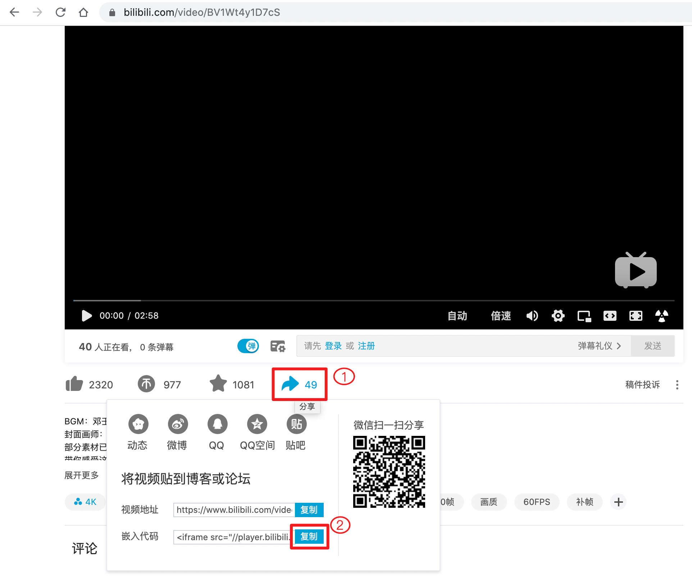

# 视频音频

随着人们已经迈入移动互联网时代，音视频的素材也越来越多，网民的阅读习惯也慢慢在发生变化，简单的图文已经不能满足广大读者的阅读诉求。在前面讲Markdown的历史时我们知道，它在2004年出现，当时的网络环境不足以支持大家要线看视频，所以Markdown自有语法并没有对音视频做支持。

为什么Markdown没有与时俱进支持多媒体呢？我猜有三个原因，一是Markdown相对简单，没有达到有开源组织对期进行专门的支持，也没有统一的编译工具；另一个原因是Markdown对HTML是支持的，可以用HTML实现多媒体的展现；还有一个原因，我觉得移动互联网的时间还不够长，随着时间的推移，Markdown最终会支持多媒体的。

本节我们分别介绍有地址音视频和网络音视频在Markdown中的展现方法。

## 有地址的视频

视频有很多格式，像早年的rmvb，现在比较流程的MP4、avi等。我们这里说的有地址，指的是这个地址是直接指向一个视频文件，可以是本地文件，也可以是一个网络视频地址。

我们先看一下视频的实例：

```
<video 
  src="https://blog.niostack.com/rewu.mp4"      
  controls="controls" width="640" height="320"
  poster = "images/video_cover.jpg">
  这个浏览器不支持视频。
</video>
```

<video 
  src="https://blog.niostack.com/rewu.mp4"      
  controls="controls" width="640" height="320"
  poster = "images/video_cover.jpg">
  这个浏览器不支持视频。
</video>

上面就是HTML实现的有地址视频，\<video\>\</video\>标签内设置视频器不支持时的内容；src属性内显示设置视频地址；poster设置点位图。Video还有其它属性，我们用表格展示一下：

| 属性 | 值 | 描述 |
| --- | --- | --- |
| autoplay | autoplay | 如果出现该属性，则视频在就绪后马上播放 |
| controls | controls | 如果出现该属性，则向用户显示控件，比如播放按钮 |
| loop | loop | 如果出现该属性，则当媒介文件完成播放后再次开始播放 |
| muted | muted | 规定视频的音频输出应该被静音 |
| poster | URL | 规定视频下载时显示的图像，或者在用户点击播放按钮前显示的图像 |
| preload | preload | 如果出现该属性，则视频在页面加载时进行加载，并预备播放，如果使用 "autoplay"，则忽略该属性 |
| src | url | 要播放的视频的 URL |
| width | pixels | 设置视频播放器的宽度 |
| height | pixels | 设置视频播放器的高度 |


## 有地址音频

什么是有地址在上一部分已经解释了，网络上最常见的音频格式MP3、AAC、WMA、Ogg 、WAV，不过最常用的还是Mp3。

我们看一下音频的写法：

```
<audio src="https://blog.niostack.com/成都.mp3" controls="controls">
  你的浏览器不支持音频播放！
</audio>
```

<audio src="https://blog.niostack.com/成都.mp3" controls="controls">
  你的浏览器不支持音频播放！
</audio>

音频使用audio标签来标识，audio标签的属性相对video少些，没有宽高和占位图等。音频地址也使用属性src来设置，我拉看看audio的其它属性。

| 属性 | 值 | 描述 |
| --- | --- | --- |
| autoplay | autoplay | 如果出现该属性，则音频在就绪后马上播放 |
| controls | controls | 如果出现该属性，则向用户显示控件，比如播放按钮 |
| loop | loop | 如果出现该属性，则每当音频结束时重新开始播放 |
| muted | muted | 规定视频输出应该被静音 |
| preload | preload | 如果出现该属性，则音频在页面加载时进行加载，并预备播放，如果使用 "autoplay"，则忽略该属性 |
| src | url | 要播放的音频的 URL |

## 无地址视频

所谓的无地址视频，一般指的是视频网站上的视频，因为这些视频都是以流媒体的方式传输到客户端的，所以我们一般是无法拿到它的真实地址。不过视频网站为了传播其网站，一般都提供了分享功能，我们可以将其提供的分享HTML代码直接贴到Mardkown中，从而将视频嵌入到我们的文档中。

比如我们想要嵌入一个Bilibili网站上的视频，先打开对就的页面，我这里打开的是<https://www.bilibili.com/video/BV1Wt4y1D7cS>，将鼠标移到视频下方的“分享”按钮上，分享按钮位于下图“1”的位置，各种分享方式会悬浮出来，此时点击“嵌入代码”后面的“复制”按钮，如下图“2”所示：



复制后得到以下代码：

```html
<iframe src="//player.bilibili.com/player.html?aid=626620549&bvid=BV1Wt4y1D7cS&cid=217946469&page=1" scrolling="no" border="0" frameborder="no" framespacing="0" allowfullscreen="true"> </iframe>
```

这个代码还不能直接使用，因为它没有设置宽高，默认显示视频面积分比较小，我们在iframe标签内增加宽和高属性，这里我把宽设置为800像素，高设置为600像素，代码如下：

```html
<iframe src="//player.bilibili.com/player.html?aid=626620549&bvid=BV1Wt4y1D7cS&cid=217946469&page=1" scrolling="no" border="0" frameborder="no" framespacing="0" allowfullscreen="true"
width="800" height="600"
> </iframe>
```

此时视频显示如下：

<iframe src="//player.bilibili.com/player.html?aid=626620549&bvid=BV1Wt4y1D7cS&cid=217946469&page=1" scrolling="no" border="0" frameborder="no" framespacing="0" allowfullscreen="true"
width="800" height="600"
> </iframe>

## 无地址音频

无地址音频目前不太好实现了，目前各音乐网站越来越少做单音频播放器了，像QQ音乐、网易音乐都没有这样的播放器分享页面了。如果要添加音频，还是需要拿到音频的准确地址，使用有地址的方式实现。