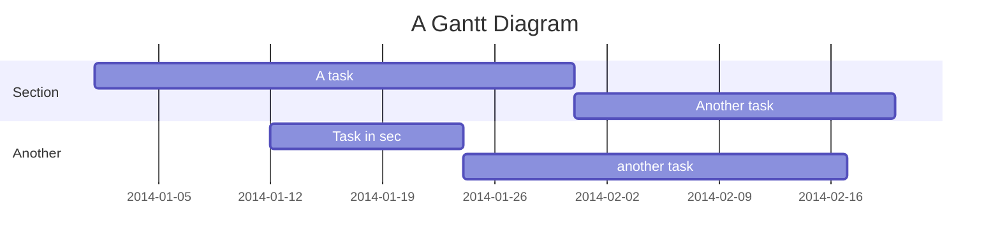
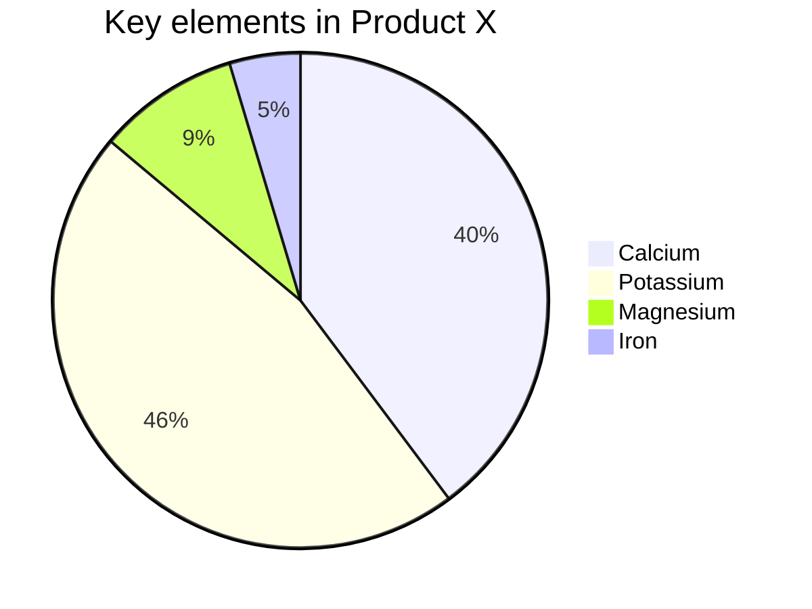

# 甘特图和饼图

Mermaid除了流程图和时序图外，还支持很多其它的图形绘制方法，本节我们会简单给出一个甘特图和饼图的实例，同时给出Mermaid更多图形绘制的文档链接，想要深入学习的同学可以看文自行研究。

## 甘特图
下面是一个甘特图实例的Markdown内容：

```
    ```mermaid
    gantt
      title A Gantt Diagram
      dateFormat  YYYY-MM-DD
      section Section
      A task           :a1, 2014-01-01, 30d
      Another task     :after a1  , 20d
      section Another
      Task in sec      :2014-01-12  , 12d
      another task      : 24d

    ```
```

甘特图显示为：



在开头第一行使用`gantt`标识图形类型；接下来使用`title`和`dateFormat`来说明甘特图的名称和日期格式。  
接下来定义每一个工作内容，标识为`section`，每个section内再定义多个Task。

点击[这里可以查看甘特图的相关文档](https://mermaid-js.github.io/mermaid/#/gantt)。

## 饼图

下面是一个饼图实例的Markdown内容：

```
    ```mermaid
    pie
      title Key elements in Product X
      "Calcium" : 42.96
      "Potassium" : 50.05
      "Magnesium" : 10.01
      "Iron" :  5
    ```
```

饼图显示为：



饼图相对比较简单，同样，在第一行使用`pie`标识图形类型，使用title表示图形名称；接下来就是定义各块儿的大小。

点击[这里可以查看饼图的相关文档](https://mermaid-js.github.io/mermaid/#/pie)。

## 其它形状的图形

Mermaid还支持其它另外几种类型的图形，可以点击查看具体文档。

+ 类图，[点击查看](https://mermaid-js.github.io/mermaid/#/classDiagram)。
+ 状态图，[点击查看](https://mermaid-js.github.io/mermaid/#/stateDiagram)。
+ 实体关系图，[点击查看](https://mermaid-js.github.io/mermaid/#/entityRelationshipDiagram)。
+ 用户旅程图，[点击查看](https://mermaid-js.github.io/mermaid/#/user-journey)。