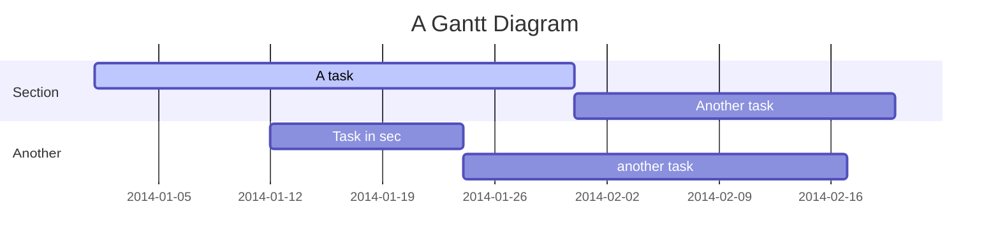
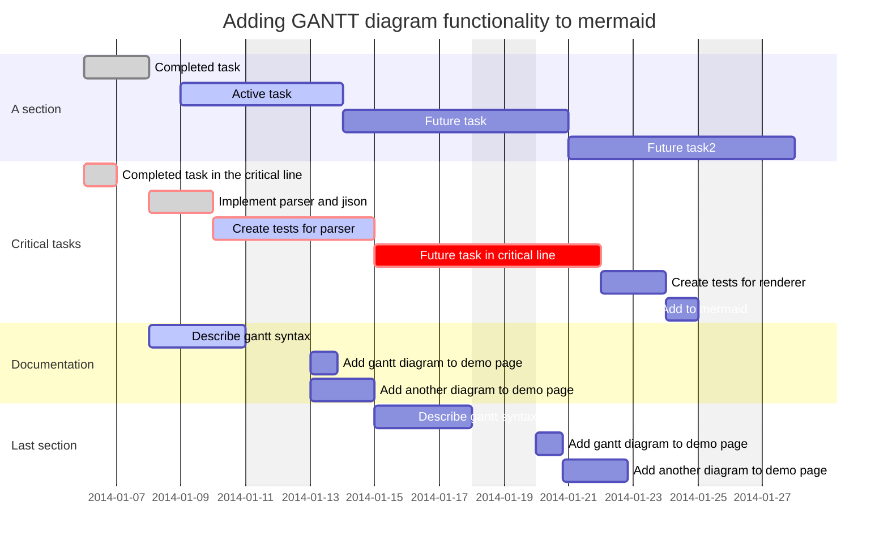
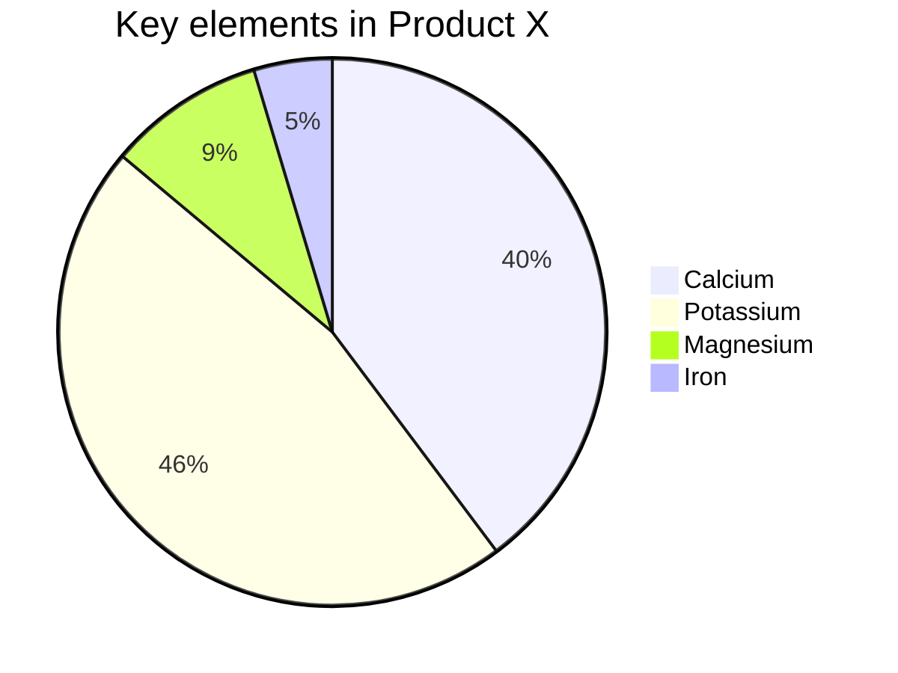

# 甘特图和饼图

Mermaid除了流程图和时序图外，还支持很多其它的图形绘制方法，本节我们会简单给出一个甘特图和饼图的实例，同时给出Mermaid更多图形绘制的文档链接，想要深入学习的同学可以看文自行研究。

## 甘特图
下面是一个甘特图实例的Markdown内容：

```
    ```mermaid
    gantt
      title A Gantt Diagram
      dateFormat  YYYY-MM-DD
      section Section
      A task           :active, a1, 2014-01-01, 30d
      Another task     :after a1  , 20d
      section Another
      Task in sec      :2014-01-12  , 12d
      another task      : 24d

    ```
```

甘特图显示为：



在开头第一行使用`gantt`标识图形类型；接下来使用`title`和`dateFormat`来说明甘特图的名称和日期格式。  
接下来定义每一个工作内容，标识为`section`，每个section内再定义多个Task。

我们再来看一个更加复杂的例子，这个例子是从mermaid官方文档中摘来的，包含了gantt图的绝大部分语法。

```
  ``` mermaid
  gantt
    dateFormat  YYYY-MM-DD
    title       Adding GANTT diagram functionality to mermaid
    excludes    weekends
    %% (`excludes` accepts specific dates in YYYY-MM-DD format, days of the week ("sunday") or "weekends", but not the word "weekdays".)

    section A section
    Completed task            :done,    des1, 2014-01-06,2014-01-08
    Active task               :active,  des2, 2014-01-09, 3d
    Future task               :         des3, after des2, 5d
    Future task2              :         des4, after des3, 5d

    section Critical tasks
    Completed task in the critical line :crit, done, 2014-01-06,24h
    Implement parser and jison          :crit, done, after des1, 2d
    Create tests for parser             :crit, active, 3d
    Future task in critical line        :crit, 5d
    Create tests for renderer           :2d
    Add to mermaid                      :1d

    section Documentation
    Describe gantt syntax               :active, a1, after des1, 3d
    Add gantt diagram to demo page      :after a1  , 20h
    Add another diagram to demo page    :doc1, after a1  , 48h

    section Last section
    Describe gantt syntax               :after doc1, 3d
    Add gantt diagram to demo page      :20h
    Add another diagram to demo page    :48h
```

效果为：



点击[这里可以查看甘特图的相关文档](https://mermaid-js.github.io/mermaid/diagrams-and-syntax-and-examples/gantt.html)。

## 饼图

下面是一个饼图实例的Markdown内容：

```
    ```mermaid
    pie
      title Key elements in Product X
      "Calcium" : 42.96
      "Potassium" : 50.05
      "Magnesium" : 10.01
      "Iron" :  5
    ```
```

饼图显示为：



饼图相对比较简单，同样，在第一行使用`pie`标识图形类型，使用title表示图形名称；接下来就是定义各块儿的大小。

点击[这里可以查看饼图的相关文档](https://mermaid-js.github.io/mermaid/diagrams-and-syntax-and-examples/pie.html)。

## 其它形状的图形

Mermaid还支持其它另外几种类型的图形，可以点击查看具体文档。

+ 类图，[点击查看](https://mermaid-js.github.io/mermaid/diagrams-and-syntax-and-examples/classDiagram.html)。
+ 状态图，[点击查看](https://mermaid-js.github.io/mermaid/diagrams-and-syntax-and-examples/stateDiagram.html)。
+ 实体关系图，[点击查看](https://mermaid-js.github.io/mermaid/diagrams-and-syntax-and-examples/entityRelationshipDiagram.html)。
+ 用户旅程图，[点击查看](https://mermaid-js.github.io/mermaid/diagrams-and-syntax-and-examples/user-journey.html)。