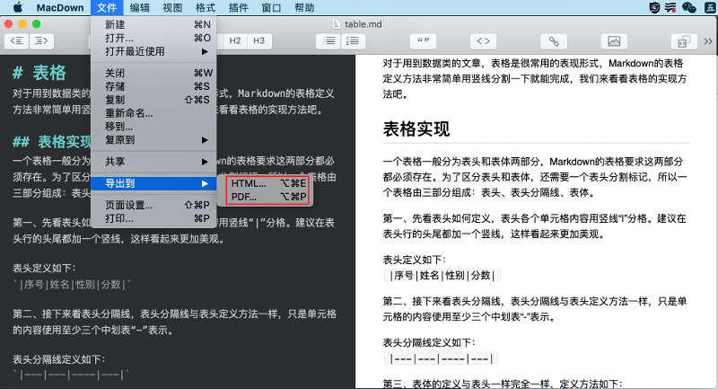
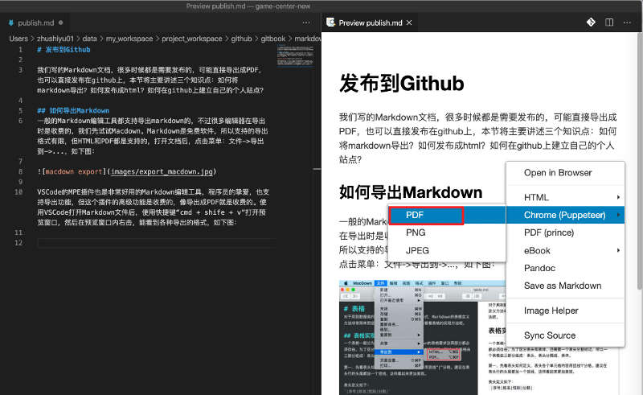
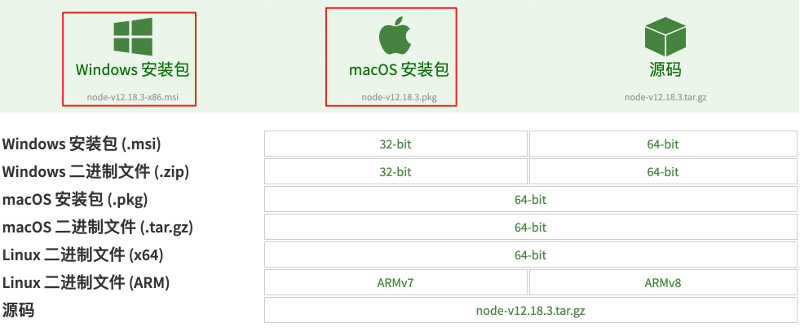
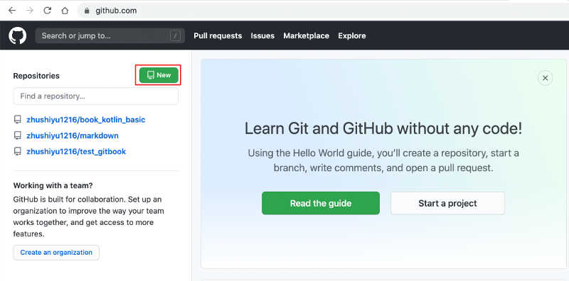
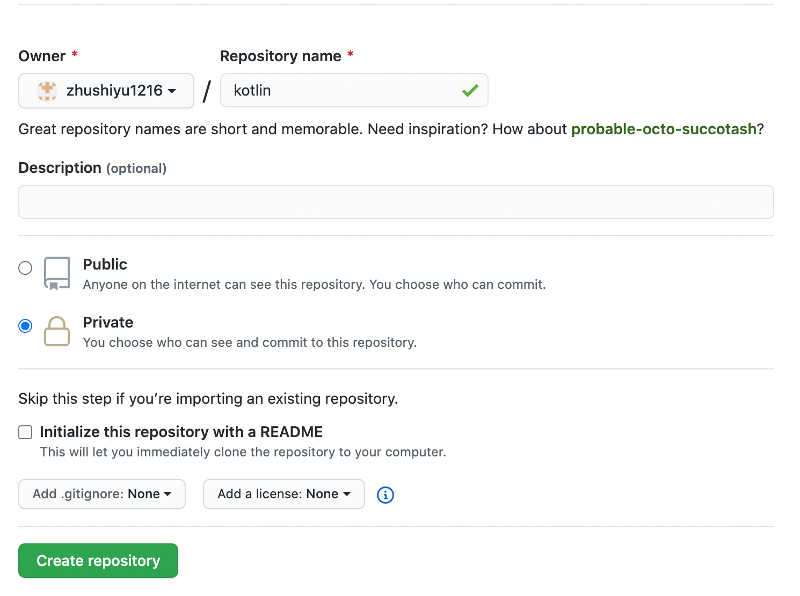
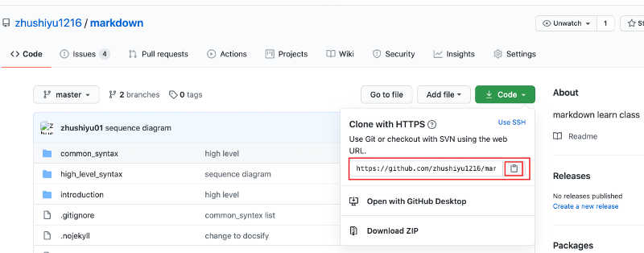
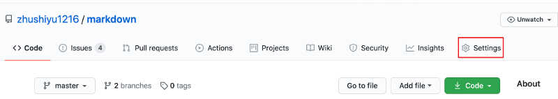
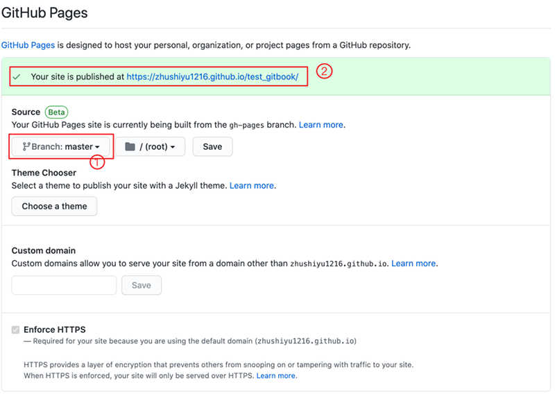

# 发布到Github

我们写的Markdown文档，很多时候都是需要发布的，可能直接导出成PDF，也可以直接发布在github上，本节将主要讲述三个知识点：如何将markdown导出？如何发布成html？如何在github上建立自己的个人站点？

## 如何导出Markdown
一般的Markdown编辑工具都支持导出markdown的，不过很多编辑器在导出时是收费的，我们先试试Macdown。Markdown是免费软件，所以支持的导出格式有限，但HTML和PDF都是支持的，打开文档后，点击菜单：文件->导出到->...，如下图：



VSCode的MPE插件也是非常好用的Markdown编辑工具，程序员的挚爱，也支持导出功能，而且支持导出的格式特别丰富。使用VSCode打开Markdown文件后，使用快捷键“cmd + shift + v”打开预览窗口，然后在预览窗口内右击，能看到各种导出的格式，如下图：



## 如何发布成HTML
前面我们说过，Markdown的文档默认是不能在浏览器正常展示的，浏览器只能显示HTML格式的文档，所以Markdown要想在浏览器正常展示，最终都要转化成HTML，或者使用Javascript动态加载。

这两种转换方式也都分别有自己的主流工具，如直接转换成HTML文件的有之前最知名的gitbook，不过gitbook目前主做在线文档服务，本地文档转换工具已经不再维护；另一个比较有名的工具是hexo，它是专门搭建博客系统的工具，使用它转换HTML需要一定的前端开发技能。另一种Javascript动态加载方式，比较出名的是docsify，它有一套自己的Js文件，在打开后动态解析markdown文件，将各markdown标签解析为HTML对应的标签，并添加在页面中。

我们就今天主要讲解docsify的使用。

+ 第一步，安装node环境
在Node官网下载适合自己操作系统的node版本，官网中文版地址：<https://nodejs.org/zh-cn/download/>，建议windows下载msi版本，mac下载pkg版本。较新的电脑一般都是64位的，如果实在不能确定电脑CPU位数，可以选择32位，64位CPU是兼容32的。



下载后双击安装，安装过程我们就不细说了，安装完成后打开命令行终端，分别执行`node -v`和`npm -v`命令，如果正常显示出版本号，则表示安装成功，执行后显示如下：

```
zhushiyu01:resource zhushiyu01$ node -v
v12.16.2
zhushiyu01:resource zhushiyu01$ npm -v
6.14.5
```

有版本号显示即可，不用关心版本号的具体值。

+ 第二步，安装docsify  
docsify是一个node的项目，通过npm来安装，将以下命令在终端内执行`sudo npm i docsify-cli -g`，以下是安装命令及显示：

```
zhushiyu01:~ zhushiyu01$ sudo npm i docsify-cli -g
/usr/local/bin/docsify -> /usr/local/lib/node_modules/docsify-cli/bin/docsify
+ docsify-cli@4.4.1
updated 1 package in 1.491s
```

注意，上边是在Mac上执行，所以加了sudo，如果在Windows上执行，只用`npm i docsify-cli -g`即可。

+ 第三步，初始化docsify项目  
使用docsify命令，可以在我们的markdown文档目录下初始化一个docsify环境，执行命令也比较简单`docsify init ./`，具体过程如下：

```
zhushiyu01:markdown zhushiyu01$ cd ~/data/temp/markdown/ 
zhushiyu01:markdown zhushiyu01$ docsify init ./

Initialization succeeded! Please run docsify serve ./
```

先cd到你的文档目录下，再执行init命令，执行成功后，会在目录下生成一个index.html文件。注意docsify默认的首页文档名称为README.md，所以我们必须有这个文件，其它文件可以在README.md中建立链接跳转过去。

+ 第四步，启动docsify服务  
要在浏览器里查看我们写的文档，只用启动docsify服务即可，启动命令为`docsify serve ./`，命令如下：

```
zhushiyu01:markdown zhushiyu01$ docsify serve ./

Serving /Users/zhushiyu01/data/temp/markdown now.
Listening at http://localhost:59587
```

注意，`./`是文档路径，如果你的命令行不是当前文件路径，需要先cd到markdown文档目录。执行完成后，docsify给出了监听地址，如上边给出的是`http://localhost:59587`，在浏览器打开这个地址即可看到我们的markdown文件内容了。

docsify在index.html中有很多功能强大的配置，同时它也提供了很多样式的插件，具体用法可以在docsify的官方文档查看：<https://docsify.js.org/#/?id=docsify>，我给出这个教程的index.html的配置，供大家参考一下。

```html
<script src="//cdn.jsdelivr.net/npm/mermaid/dist/mermaid.min.js"></script>
  <div id="app"></div>
  <script>
    var num = 0;
    mermaid.initialize({ startOnLoad: false });

    window.$docsify = {
      name: 'Markdown教程',
      repo: '',
      loadSidebar: true,
      search: 'auto',
      search: {
        maxAge: 86400000,
        paths: '/',
        placeholder: '搜索...',
        noData: '未找到结果，换个搜索词试试？',
        namespace: 'markdown',
      },
      disqus: 'shortname',

      markdown: {
        renderer: {
          code: function(code, lang) {
            if (lang === "mermaid") {
              return (
                '<div class="mermaid">' + mermaid.render('mermaid-svg-' + num++, code) + "</div>"
              );
            }
            return this.origin.code.apply(this, arguments);
          }
        }
      },
      
    }
  </script>
  <script src="//cdn.jsdelivr.net/npm/docsify/lib/docsify.min.js"></script>
  <script src="//cdn.jsdelivr.net/npm/docsify/lib/plugins/search.min.js"></script>
  <script src="//cdn.jsdelivr.net/npm/docsify/lib/plugins/zoom-image.min.js"></script>
  <script src="https://unpkg.com/docsify-copy-code@2"></script>
  <script src="//cdn.jsdelivr.net/npm/docsify/lib/plugins/disqus.min.js"></script>
  <script src="//cdn.jsdelivr.net/npm/docsify-pagination/dist/docsify-pagination.min.js"></script>
  <script src="//cdn.jsdelivr.net/npm/docsify/lib/plugins/gitalk.min.js"></script>
  <script src="//cdn.jsdelivr.net/npm/gitalk/dist/gitalk.min.js"></script>
  <script>
    const gitalk = new Gitalk({
      clientID: 'a05bf308e53db59198de',
      clientSecret: '41ebf7387bb7b6b8ada332548bdc616044d033da',
      repo: 'markdown',
      owner: 'zhushiyu1216',
      admin: ['zhushiyu1216'],
      id: window.location.hash,
      distractionFreeMode: false
    })
  </script>
  <script src="//cdn.jsdelivr.net/npm/docsify-katex@latest/dist/docsify-katex.js"></script>
```

## 将文档发布到github

github是大名鼎鼎的免费代码托管网站，前段时间github已经被微软收购。github功能十分强大，除进行代码托管外，还可以支持markdown文档说明，支持代码文档页面。利用github提供的文档页面功能，我们可以用markdown建立自己的免费网站了，很多程序员就利用Hexo + markdown在github上建立自己的博客系统。github是美国的网站，服务器也都在美国，所以网速不是太快，偶尔也会因为政府信息管控等原因造成短暂的不可访问。不过作为一个知名又免费的站点已经很好了。

+ git安装
在使用Github前，我们的电脑上要安装有git工具。

windows系统电脑安装，在网站<https://git-scm.com/download/win>上下载适合自己电脑的git客户端，建议下载setup版本的。安装完成后可以打开Git CMD来操作。

Mac系统电脑有可能已经安装了git，打开命令行终端窗口，输入`git`，显示以下内容则表示系统已经安装了git：

```
zhushiyu01:markdown zhushiyu01$ git
usage: git [--version] [--help] [-C <path>] [-c <name>=<value>]
           [--exec-path[=<path>]] [--html-path] [--man-path] [--info-path]
           [-p | --paginate | -P | --no-pager] [--no-replace-objects] [--bare]
           [--git-dir=<path>] [--work-tree=<path>] [--namespace=<name>]
           <command> [<args>]
```

如果没有安装，则先安装homebrew工具，安装命令如下：

```
/usr/bin/ruby -e "$(curl -fsSL https://raw.githubusercontent.com/Homebrew/install/master/install)"
```

homebrew安装成功后，使用brew来安装git，安装命令如下：

```
brew install git
```

安装完成后再使用git命令测试，显示以下内容表示安装成功。

```
zhushiyu01:markdown zhushiyu01$ git
usage: git [--version] [--help] [-C <path>] [-c <name>=<value>]
           [--exec-path[=<path>]] [--html-path] [--man-path] [--info-path]
           [-p | --paginate | -P | --no-pager] [--no-replace-objects] [--bare]
           [--git-dir=<path>] [--work-tree=<path>] [--namespace=<name>]
           <command> [<args>]
```

+ 管理github上的代码仓库

我们假设你已经有github的帐号了，如果没有，快去注册一个吧。登录github后页面的左边会有你已有的仓库列表，我们可以点击“New”建一个新仓库，如下图：



在新建仓库的页面，仓库名称可以随意起，但尽量使用英文，因为它会成为我们文档页面域名的一部分，比如我们起名为kotlin；仓库有private和public权限，我们是个人的仓库，不希望别人修改，所以可以选择private；description可以不写；最下边还有个是否初始化readme的选择，可以不勾选，因为毕竟我们的仓库不是一个代码项目。



点击“Create repository”按钮，创建仓库，仓库创建完成后，可以点击我们github首页（上上图）左边的创建列表中的kotlin创建，进入仓库文件页。在仓库文件页有一个“Code”按钮，点击后可以看到代码的git地址，如下图：



点击复制地址按钮，即可以复制git仓库地址。

接下来我们将github的代码clone到本地，先cd到我们markdown文档的目录，然后执行git clone命令拉取代码。

```
zhushiyu01:markdown zhushiyu01$cd ~/data/temp/markdown/
zhushiyu01:markdown zhushiyu01$git clone https://github.com/zhushiyu1216/markdown.git
Cloning into 'markdown'...
remote: Enumerating objects: 204, done.
remote: Counting objects: 100% (204/204), done.
remote: Compressing objects: 100% (151/151), done.
remote: Total 204 (delta 63), reused 180 (delta 45), pack-reused 0
Receiving objects: 100% (204/204), 9.03 MiB | 599.00 KiB/s, done.
Resolving deltas: 100% (63/63), done.
```

下一步我们上传代码，执行以下命令：

```
git add .
git commit -m "add files"
git push origin master
```

我们分别解释一下这三条命令：  
`git add .`表示把本地修改的文件都添加到本地git仓库管理列表，“.”表示所有文件。  
`git commit -m "add fiels"`表示将刚才添加或修改的文件提交到本地仓库， “-m”表示后面的双引号内是注释，注释内容可以根据自己的需要填写。  
`git push origin master`，表示将本地的代码推送到github的远端仓库，origin表示当前目录绑定的远端仓库，master表示推送到github仓库的哪个分支，我们没有建分支，所以默认写master；origin也可以使用刚才从仓库文件页负责的仓库地址替代，如：`git push https://github.com/xxx/markdown.git master`。

平时我们对markdown文件有修改时，在修改完成，可以重复执行以上三条命令提交文件。


+ 配置Markdown文档页

在仓库首页，点击顶部的“Settings”tab，如下图：



在Settings页面，向下滚去页面，找到“Github Pages”部分，如下图，将“1”部分的分支设置为“master”即可，点击它后面的“Save按钮；图中“2”的部分就是我们页面的地址啦，将这个地址贴到浏览器就可以打开我们的方面页面了。



至此，我们一个简单的个人小网站就建立成功了，不用买服务器，随时可以转给别人看，是不是很方便，只要我们学会了Markdown，以后编写专业的文档就不再是什么难事啦。


### 视频教程
<iframe src="//player.bilibili.com/player.html?aid=542283584&bvid=BV1ei4y1E78N&cid=242199499&page=1" scrolling="no" border="0" frameborder="no" framespacing="0" allowfullscreen="true" width="800" height="600"> </iframe>

[打赏](../include/donate.md ':include')
