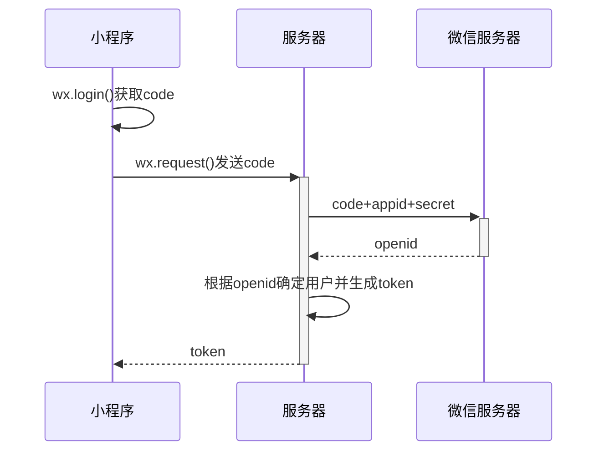
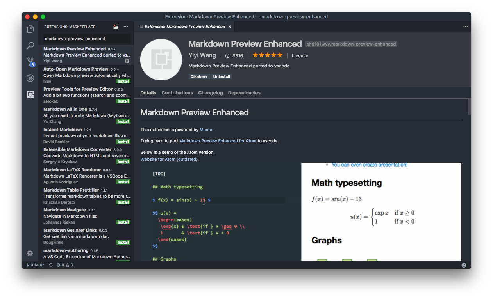
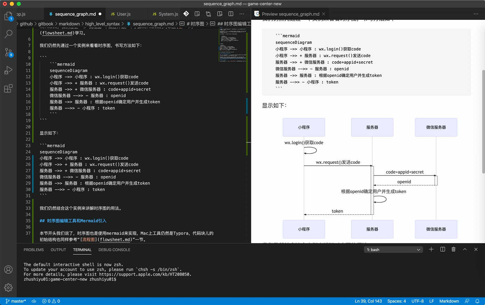
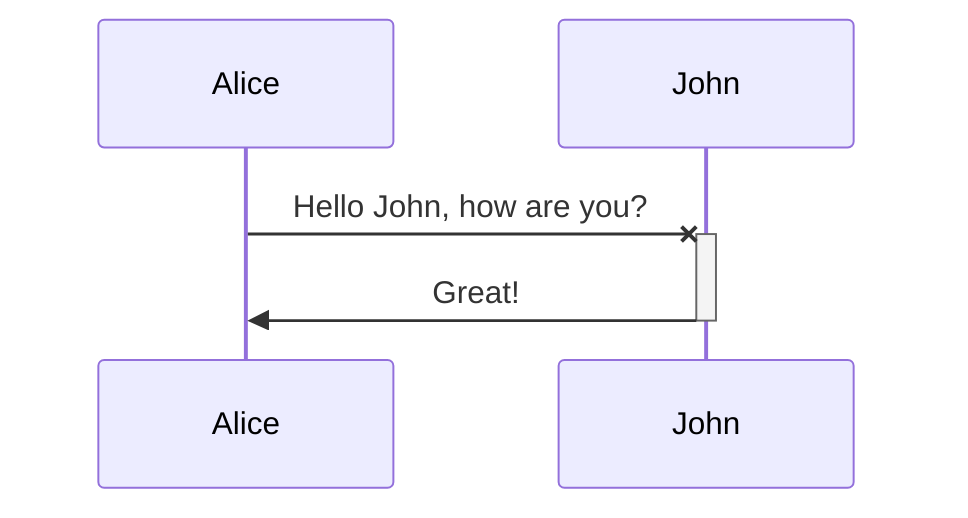

# 时序图

如果你是一个程序员，那你对时序图一定不会陌生，对于程序中方法的调用，时序图是最清晰的一种表现形式了。

Markdown的时序图也是通过第三方引入功能实现的，我们这里仍然使用mermaid实现。关于mermaid，我们在上一节“流程图”中做过介绍，不了解mermaid的可以去[上一节](flowsheet.md)学习。

我们仍然先通过一个实例来看看时序图，书写方法如下：

```
    ```mermaid
    sequenceDiagram
    小程序 ->> 小程序 : wx.login()获取code
    小程序 ->> + 服务器 : wx.request()发送code
    服务器 ->> + 微信服务器 : code+appid+secret
    微信服务器 -->> - 服务器 : openid
    服务器 ->> 服务器 : 根据openid确定用户并生成token
    服务器 -->> - 小程序 : token
    ```
```

显示如下：



我们仍然结合这个实例来讲解时序图的用法。

## 时序图编辑工具和Mermaid引入

本节开头我们说了，时序图也是使用mermaid来实现，Mac上工具仍然是Typora，代码块儿的初始结构也同样参考“[流程图](flowsheet.md)”一节。

如果你在学习时序图，那想必你是一名程序员，强烈建议你使用VS Code + MPE(markdown-preview-enhanced)插件来写Markdown，VS Code是最近两年如日中天，且是微软出的免费IDE工具，MPE插件跟Macdown很像，更符合程序员掌控代码的习惯。

（1）MPE插件安装方法：打开VSCode -> 点击左边Extenions按钮 -> 搜索（markdown-preview-enhanced） -> 点击安装。



（2）使用方法：使用vscode打开Markdown文件 -> 使用快捷键`cmd + shift + v`(Mac)或`ctrl + shift + v`(Windows)打开预览窗口 -> 点击VSCode顶部`split editor right` -> 将markdown预览窗口拖到右边新打开的editor区。显示如下：



在左侧写Markdown，右边窗口可以直接预览啦，很方便。

## 时序图基本语法

## 时序图标识
在mermaid代码块中，第一句使用`sequenceDiagram`标识下面的语句解析为时序图。

## 语法格式

时序图格式为：操作者 调用符 操作者: 调用方法（说明）。  
如上边的第二句`小程序 ->> + 服务器 : wx.request()发送code`，“小程序”为操作者二，“服务器”为操作者二，“->> +”为操作符，表示小程序调用服务器，“+”号的作用我们后面说明，“wx.request()发送code”表示操作内容。

上边实例的第一句`小程序 ->> 小程序 : wx.login()获取code`，这里两个操作者是同一个，表示是自调用。

## 操作者
通过语法格式中介绍，我们已经知道了操作者的概念，如果操作者名字太长，还可以起别名，语法为：

`participant Alice as 小程序 `

这样后面再写调用关系时可以使用别名“Alice”，再举个例子：

```
sequenceDiagram
    participant A as Alice
    participant J as John
    A -x J: Hello John, how are you?
    J->>A: Great!
```



## 调用符

（1）“->>”表示左边调用右边，Mermaid还有虚线调用、无箭头调用等另个几个调用符，具体如下：

| 调用符 | 说明 |
| --- | --- |
| -> | 实线无箭头 |
| --> | 虚线无箭头 |
| ->> | 实线有箭头 |
| -->> | 虚线有箭头 |
| -x | 实线带箭头，同时箭头处有个叉号，一般表示异步 |
| --x | 虚线带箭头，同时箭头处有个叉号，一般表示异步 |

（2）我们在操作符后可以跟着“+”、“-”号，这个加减号表示当前操作者是否是处于活动状态，一般这两个要对称使用。

它们实际上是“activate”和“deactivate”两个指令的简写法，细节可以研究后面的时序图详细官方文档。

### 视频教程
<iframe src="//player.bilibili.com/player.html?aid=584792032&bvid=BV1Pz4y1f7FA&cid=240133720&page=1" scrolling="no" border="0" frameborder="no" framespacing="0" allowfullscreen="true" width="800" height="600"> </iframe>

## 官方文档

时序图还有很多非常精彩的用法，如果要深入学习，可以研究一下Mermaid关于时序图的官方文档，此文档如下，尽管是英文版的，但都比较简单，一般都可以轻松看懂的。

[Mermaid sequenceDiagram](mermaid_sequence_diagram_doc.md ':include')