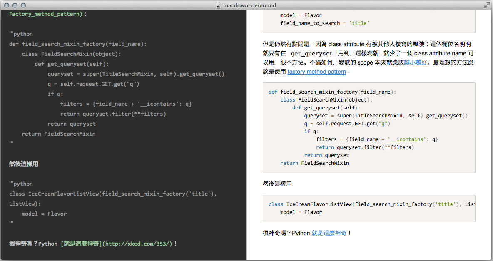
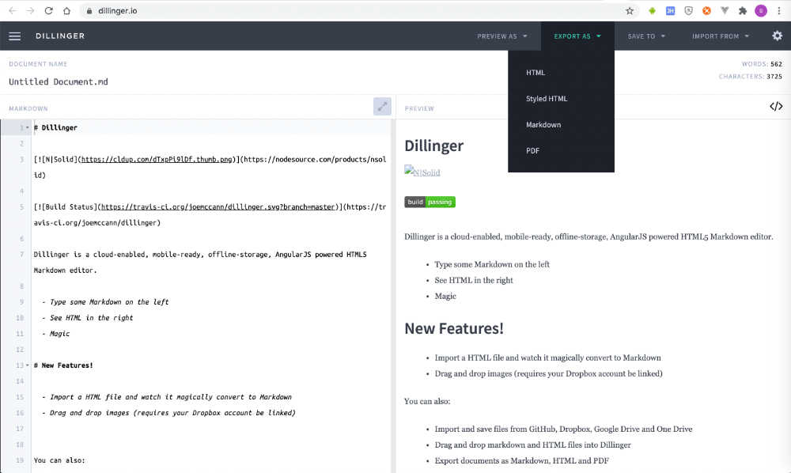
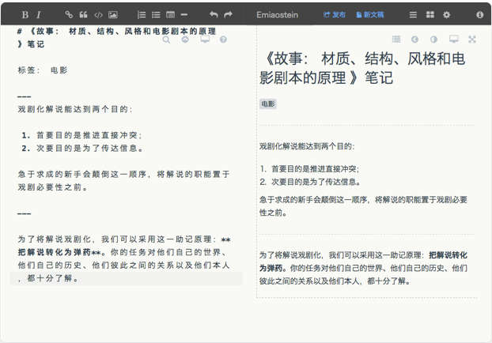
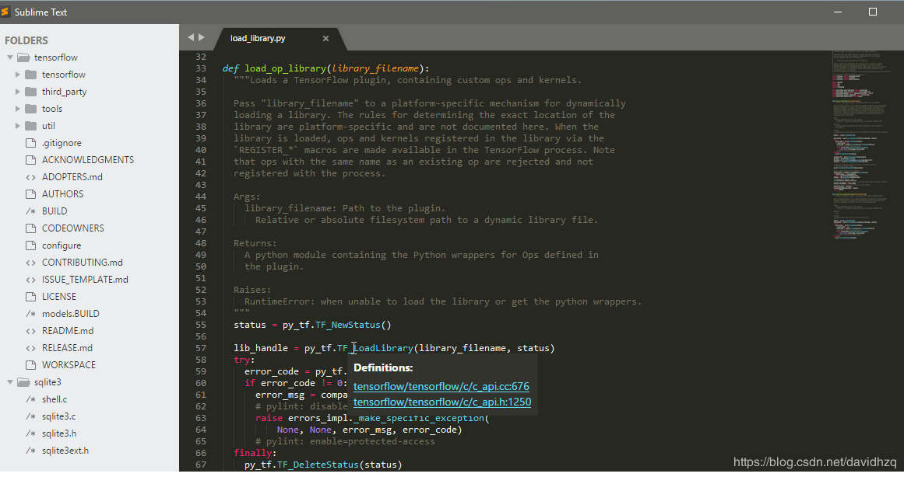

# Markdown常用编写工具
用 Markdown 写作并没有什么讲究，就像程序员可以直接在记事本上写代码一样，我们也完全可以在记事本上用 Markdown 码字，最后再用支持 Markdown 的编辑器转换即可。

当然，大多数情况下我们还是使用 Markdown 编辑器，这些软件往往支持语法检测，也可以预览排版效果，提供更好的写作体验。

市面上的 Markdown 编辑器实在太多了，我们筛选出部分口碑较好的产品。

## [MarkdownPad](http://www.markdownpad.com)
支持平台：Windows

款全功能的编辑器，被很多人称赞为windows 平台最好用的markdown编辑器，使用Windows系统电脑的同学建议使用这个编辑器。它有免费版和收费版（MarkdownPad Pro），一般情况下免费版就够用了。

## [MacDown](https://macdown.uranusjr.com)
支持平台：Mac

简洁优雅，开源免费，开源爱好者的首选，在Mac的App Store里直接搜索就可以安装。

## [Mou](http://25.io/mou)
支持平台：Mac

Mou 是一款由国人开发的Markdown 编辑器，支持实时预览，但是仅支持 苹果操作系统，可以说是目前最好用的免费 Markdown 编辑器，对汉字兼容性非常好。提供语法高亮、在线预览、同步滚动、全屏模式，支持自定保存、自动匹配，允许自定义主题等等。支持 CSS，HTML 和 PDF 导出等功能。

## [Typora](https://typora.io)
支持平台：MacOS， Windows、Linux

提到 Markdown 写作器，一定绕不开 Typora 的名字。Typora 完全免费，软件界面简洁到就像 Mac 自带的文本编辑器，它并不像主流的 Markdown 编辑器一样采用双栏布局，而是将写作与预览窗口合为一体，输入标记后即可实时输出效果，实现「所见即所得」。

Typora看到的不是markdown的源码，看到的是最终的显示效果，对于程序员来说不一定那么习惯。

## [Dilinger](https://dillinger.io)
dillinger是一个在线的markdown编辑工具，漂亮强大，支持md, html, pdf 文件导出，不过dilinger在国外，找开速度很慢。

## [Cmd Markdown](https://www.zybuluo.com/cmd)
支持平台：Windows、Linux、Mac、在线

CmdMarkdown作业部落出品，全平台并支持Web端，它是国内的应用，Web版打开速度比Dilinger快很多。CmdMarkdown是作业部落的客户端，可以直接云存储你的markdown文档，如果你的目的是在线写一些笔记，它是你的首选，不过CmdMarkdown需要注册作业部落的帐号才可以使用。

## 其它
下面的这些都是支持云存储功能的收费软件，除在PC上使用外，也提供了对应的手机版应用，会费的，功能也自然更加强大，有财力的可以选择它们。

[Ulysses](https://ulysses.app)- 支持Mac、Iphone、Ipad

[iA Writer](https://ia.net/writer) - 支持 Mac、IOS、Windows、Android

[Bear](https://bear.app) - 支持平台：MacOS、iOS

除此之外，你也可以使用Atom或SublimeText，它们是通用的文本编辑器，通过安装Markdown的插件来达到格式化转化的效果。

[Atom](https://atom.io/) 可以说是专门为程序员推出的一个文本编辑器，界面简洁，支持实时预览。功能非常多，除了Markdown同时支持CSS，HTML，JavaScript等网页编程语言，还支持宏定义，自动分屏功能等。Atom还具有语义输入模式，比例输入code即会自动开启代码模式。  
Atom支持windows、苹果、linux等多种操作系统。Atom是由著名的github平台出品的。

[SublimeText](http://www.sublimetext.com/)界面简约大方，定位专业，功能强大，并具有良好的扩展功能。SublimeText是收费软件，支持windows、苹果、linux三大操作系统。支持的编程语言有十几种，并可通过第三方插件无限扩充。SublimeText默认不能实时预览，但通过 Markdown Preview 的插件来实现该功能。SublimeText屏幕右边有一个文档缩略图，可以看到文档全貌。

如果你是一个程序员，可以使用这两款软件，不过说实话，效果并没有专门的MarkDown编辑软件好用。